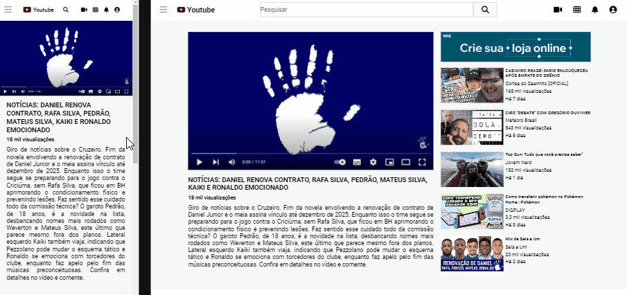

#  YouTube page - running video(static image) with suggested videos and an advertising banner

## Table of contents

  - [The challenge](#the-challenge)
  - [gif](#gif)
  - [Built with](#built-with)
  - [What I learned](#what-i-learned)

### The challenge

Users should be able to:

- View the optimal layout for the page depending on their device's screen size
- See hover states for all interactive elements on the page
- Interact with the hamburguer menu

### Gif

# Click the icon at the top right corner of the gif to check the project's github page

### Built with

- Semantic HTML5 markup
- CSS custom properties
- Flexbox
- CSS Grid

### What I learned

This project proved to be a little bit of a challenge at the coding of the hamburguer menu. I did this kind of menu before, but this one especially had some minor differences that made me work hard
